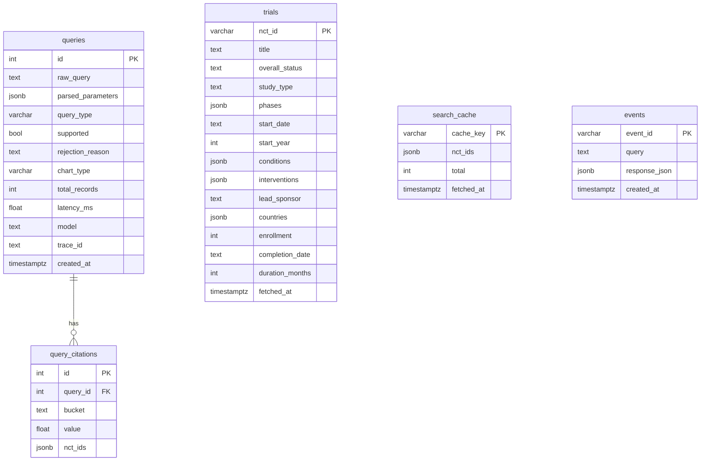

# Database schema

Postgres (`postgres:16`). The schema is defined in [`models.py`](./models.py) (SQLAlchemy 2.0)
and created on startup via `Base.metadata.create_all` in [`session.py`](./session.py) — there is
no migration tool in this take-home (Alembic would replace `create_all` in production).

Five small tables: a **query history/log**, a **trial cache**, a **search-result cache**
(`search_cache`) that makes the trial cache read-through, the **citation source‑trail**, and a
**saved-results store** (`events`) that powers shareable `/<event_id>` permalinks.

## `queries` — one row per `POST /api/query`

Audit log of every request: what was asked, how the agent interpreted it, and runtime stats.
Doubles as observability/eval data.

| Column | Type | Notes |
|---|---|---|
| `id` | `int` PK | auto-increment |
| `raw_query` | `text` | the natural-language question |
| `parsed_parameters` | `jsonb` | full `QuerySpec` (`model_dump`) the LLM produced |
| `query_type` | `varchar(32)` | closed taxonomy: `time_trend` / `distribution` / `comparison` / `geographic` / `relationship` / `correlation` / `unsupported` |
| `supported` | `bool` | false → rejected by the capability gate |
| `rejection_reason` | `text` null | populated when unsupported |
| `chart_type` | `varchar(32)` null | `line` / `bar` / `grouped_bar` / `network` / `scatter` |
| `total_records` | `int` | exact total trials matched (API `countTotal`) |
| `latency_ms` | `float` | end-to-end pipeline latency |
| `model` | `text` null | classifier model used |
| `trace_id` | `text` null | correlates to the query id surfaced to the client |
| `created_at` | `timestamptz` | server default `now()` |

## `trials` — ClinicalTrials.gov cache

Normalized, flattened trial records (one row per NCT id) fetched during a query. Read back on a
cache hit (via `search_cache`) to avoid re-hitting the API, makes citations reproducible, and is
the table a future ingestion pipeline / semantic search would build on.

| Column | Type | Notes |
|---|---|---|
| `nct_id` | `varchar(20)` PK | e.g. `NCT01234567` |
| `title` | `text` | brief title |
| `overall_status` | `text` null | e.g. `RECRUITING` |
| `study_type` | `text` null | `INTERVENTIONAL` / `OBSERVATIONAL` |
| `phases` | `jsonb` | list of friendly labels, e.g. `["Phase 2","Phase 3"]` |
| `start_date` | `text` null | raw API date string |
| `start_year` | `int` null | parsed year (for trend aggregation) |
| `conditions` | `jsonb` | list of condition strings |
| `interventions` | `jsonb` | list of `{type, name}` objects |
| `lead_sponsor` | `text` null | lead sponsor name |
| `countries` | `jsonb` | list of location countries |
| `enrollment` | `int` null | enrollment count (x-axis for the correlation/scatter chart) |
| `completion_date` | `text` null | raw API completion date string |
| `duration_months` | `int` null | start→completion span in months (y-axis for scatter) |
| `fetched_at` | `timestamptz` | server default `now()`; freshness check for the cache |

Upserts are idempotent (`INSERT ... ON CONFLICT (nct_id) DO UPDATE`), deduped by `nct_id`
before the bulk write.

## `search_cache` — read-through search index

Makes the trial cache read-through. One row per distinct search, keyed by a hash of the exact
ClinicalTrials.gov params. On a fresh hit the pipeline re-hydrates the trial records from
`trials` by `nct_ids` instead of calling the API; a stale row (older than `CACHE_TTL_SECONDS`)
or a partial hit (some trials evicted) falls through to a live fetch that repopulates it.

| Column | Type | Notes |
|---|---|---|
| `cache_key` | `varchar(64)` PK | SHA-256 of the normalized API params + fetch bounds |
| `nct_ids` | `jsonb` | the result set (sampled NCT ids, ≤ `MAX_RECORDS`) |
| `total` | `int` | true `countTotal` for the search |
| `fetched_at` | `timestamptz` | server default `now()`; bumped on refresh, drives TTL |

Exact per-bucket counts are **not** cached here — they stay live so chart values are always
accurate even on a hit.

## `query_citations` — deep-citation source trail

Each row maps one **visualization data point** (a bar/line bucket, a grouped-bar column, a
scatter point, or a network edge label) back to the exact trials that produced it. The inline
API response additionally carries a per-trial `excerpt` (the supporting field/value); only the
`nct_ids` are persisted here, since excerpts are re-derivable from `trials`.

| Column | Type | Notes |
|---|---|---|
| `id` | `int` PK | auto-increment |
| `query_id` | `int` FK → `queries.id` | `ON DELETE CASCADE` |
| `bucket` | `text` | data-point label, e.g. `"Phase 2"` or `"Acme → Donepezil"` |
| `value` | `float` | the point's value (exact count) |
| `nct_ids` | `jsonb` | contributing NCT ids (sampled evidence) |

## `events` — saved results (shareable permalinks)

Stores the full rendered `QueryResponse` for each query so a result can be reopened later at
`http://localhost:5173/<event_id>`. The `event_id` (a UUID hex) is generated per request,
returned in the API response, and resolved by `GET /api/events/{event_id}`.

| Column | Type | Notes |
|---|---|---|
| `event_id` | `varchar(36)` PK | UUID hex; used in the permalink URL |
| `query` | `text` | the original natural-language query |
| `response_json` | `jsonb` | the complete `QueryResponse` (viz spec + citations + summary) |
| `created_at` | `timestamptz` | server default `now()` |

This table is intentionally denormalized (a self-contained snapshot) so a permalink renders
identically later without re-querying ClinicalTrials.gov or the LLM. `response_json` holds
either a full `QueryResponse` (successful query) or an `unsupported_query` payload (rejected
query) — rejected queries are persisted here too, and logged in `queries` with `supported=false`.

## Suggested indexes (production)

`create_all` only builds PK/FK constraints. For scale you'd add:
`trials(start_year)`, `trials(lead_sponsor)`, `query_citations(query_id)`, and a `GIN` index
on the `jsonb` columns you filter on.
